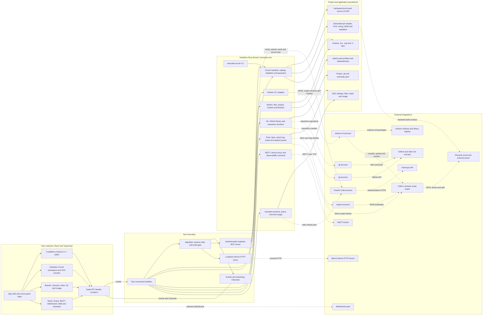
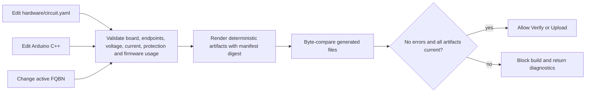

# Current-state application architecture

This is the reviewed runtime architecture after adding synchronized circuit design. Solid arrows are in-process calls or local IPC; dotted arrows cross a process, network, filesystem, or hardware boundary.

## Circuit synchronization path

One validator is shared by the guided editor, command-line workflow, toolbar build actions, and embedded assistant. This keeps user and agent operations from developing different safety rules.

The source and generated ownership split is:

| Owner | Files | Rule |
|---|---|---|
| User or guided editor | `hardware/circuit.yaml` | Canonical circuit declaration |
| Arduino CLI ecosystem | `sketch.yaml`, sketch sources | Active board target and firmware behavior |
| Circuit generator | `src/bancada_circuit_pins.h`, `hardware/circuit.svg`, `hardware/wiring.md`, `hardware/bom.csv`, `hardware/validation.json` | Never hand-edit; regenerate and commit together |

## Architecture review

### What is working well

- The UI crosses the native boundary through one typed facade, and Rust decisions remain in the headless `bancada-core` crate.
- Mature external engines remain authoritative for compilation, upload, dependency resolution, Git operations, and assistant authentication.
- Long-lived hardware/network sessions are explicit `AppState` owners with defined eviction and teardown behavior.
- Circuit data now follows the same headless-domain rule: one versioned manifest, deterministic output, a CLI, and a shared build guard.
- Projects without a circuit manifest are backward compatible; projects opting in fail closed when hardware data is malformed, unsafe, stale, or incompatible with the selected target.

### Current risks and recommended direction

| Priority | Finding | Consequence | Direction |
|---|---|---|---|
| High | `src-tauri/src/lib.rs` remains the command, session, process, and listener composition root | Changes in one subsystem create broad review and formatting diffs | Extract domain command modules behind the existing `AppState` and emitter seams |
| High | `src/App.tsx` still owns most cross-panel orchestration | State interactions are difficult to render-test and easy to regress | Move pane selection, build readiness, and project lifecycle into tested stores/controllers |
| Medium | Rust and TypeScript IPC models are mirrored manually | A field or command-name drift is a runtime failure | Generate TS contracts from Rust schemas or add a schema compatibility test |
| Medium | Circuit validation can only verify declared component data | A wrong part number, physical wire, or omitted load can pass declaration checks | Keep datasheet verification and pre-power inspection mandatory; add richer sourced component profiles over time |
| Medium | Board catalog data ships in code | New board revisions require an application release and careful source review | Version catalog entries independently and retain source URL/revision metadata |
| Medium | No hosted CI is configured | Full regression checks depend on local discipline | Keep the required local check documented; add CI only if project policy changes |
| Low | Generated SVG is a logical wiring view, not a PCB/netlist tool | It cannot prove physical layout, clearances, or manufacturability | Treat it as bench documentation; use a dedicated EDA tool for PCB design |

## Trust boundaries

1. Project files and circuit declarations are untrusted input: parsing and path containment happen before writes or builds.
2. External processes are trusted engines but fallible integrations: missing binaries, version drift, output parsing, and exit status are surfaced as explicit errors.
3. The assistant is the adversarial action boundary: file confinement, a strict tool set, bearer-authenticated loopback MCP, upload arming, and the shared circuit/build guard all apply.
4. Physical hardware remains outside what software can prove. A passing check means the declaration is internally consistent and synchronized with code; it does not replace datasheets, measurement, inspection, or safe bring-up.
